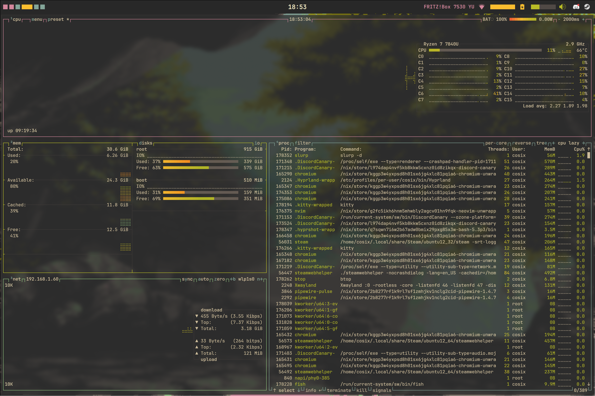

<div align="center"></div>


# nix-0
A minimal ***❄ NixOs configuration ❄*** using [**Hyrpland**](https://github.com/hyprwm/Hyprland) and [**Quickshell**](https://quickshell.org), with application styled by [**Stylix**](https://github.com/danth/stylix).

<div align="center"></div>
<div align="center"></div>

# Installation
1. **Clone the repository** in the home directory or where you want:
```bash
git clone https://github.com/Numb-0/nix-0.git ~/nix-0
```
2. **Navigate to directory**
```bash
cd ~/nix-0
```
3. **Generate Hardware Config and replace it**
```bash
nixos-generate-config --show-hardware-config > hosts/<hostname>/hardware.nix
```
4. **Apply flake configuration**
```bash
nixos-rebuild switch --flake .#<hostname> (if using the ssh flake add --remote-sudo )
```

> [!TIP]
> Make sure you have NixOS installed and flakes enabled before proceeding. If you encounter any issues, refer to the NixOS documentation. 📚

# Personalization

To customize the configuration, you can modify the values in the **[variables.nix](modules/core/variables.nix)** file.  
This file contains variables that are used to set options across different parts of the configuration, such as:

- **Hyprland**
- **Git**
- And more...

> [!WARNING]
> **Not all settings are controlled by variables!**  
> Most options are defined in the **[config.nix](hosts/framework/config.nix)** file, so make sure to check there as well. 🛠️

# Keybinds

| Keys | Action |
| :--- | :---  |
| <kbd>Super</kbd> + <kbd>Q</kbd> | Close focused window |
| <kbd>Super</kbd> + <kbd>T</kbd> | Launch terminal |
| <kbd>Super</kbd> + <kbd>E</kbd> | Launch browser |
| <kbd>Shift</kbd> + <kbd>Enter</kbd> | Toggle window fullscreen|
| <kbd>Super</kbd> + <kbd>A</kbd> | Toggle Applauncher|
| <kbd>Super</kbd> + <kbd>D</kbd> | Toggle Dashboard |
<!-- | <kbd>Super</kbd> + <kbd>P</kbd> | Toggle AudioPlayer | -->
<!-- | <kbd>Super</kbd> + <kbd>C</kbd> | Remove Last Notification| -->
| More to add |

