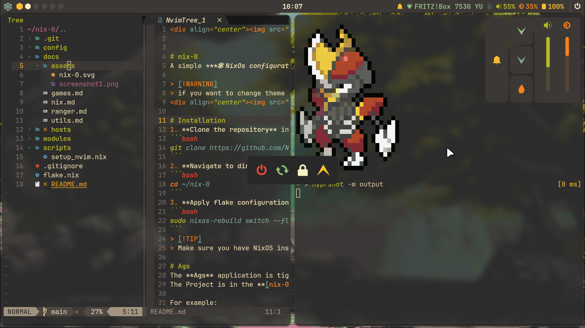

<div align="center"></div>


# nix-0
A simple ***❄ NixOs configuration ❄*** using [**Hyrpland**](https://github.com/hyprwm/Hyprland) and [**Ags**](https://github.com/Aylur/ags) themed in [**Catppuccin Macchiato**](https://catppuccin.com/palette) base16 colors with [**Stylix**](https://github.com/danth/stylix).

> [!WARNING]
> if you want to change system color theme go [***here***](https://github.com/Numb-0/nix-0/blob/main/hosts/nixos/config.nix#L34) and change the ***scheme*** entry with `"catppuccin"` or `"gruvbox"`  
> to change ags theme instead do `super+x` and toggle the arrow

<div align="center"></div>
<div align="center"></div>

# Installation
1. **Clone the repository** in the home directory or where you want:
```bash
git clone https://github.com/Numb-0/nix-0.git ~/nix-0
```
2. **Navigate to directory**
```bash
cd ~/nix-0
```
3. **Generate Hardware Config and replace it**
```bash
nixos-generate-config --show-hardware-config > hosts/<hostname>/hardware.nix
```
4. **Apply flake configuration**
```bash
nixos-rebuild switch --flake .#<hostname> (if using the ssh flake add --remote-sudo )
```

> [!TIP]
> Make sure you have NixOS installed and flakes enabled before proceeding. If you encounter any issues, refer to the NixOS documentation. 📚

# Ags
The **Ags** application is tightly integrated with **Hyprland** using it's module. If you're using another window manager (WM), most of its features **won't work**.
The Project is in the **[zero-shell repo](https://github.com/Numb-0/zero-shell)**.

For example:
- **Hyprland keybinds** are used to hide/show different windows of the Ags application.  
If you're not using Hyprland, this functionality will **not be available**.
The wifi module is **not** implemented yet!

> [!IMPORTANT]
> I've recently migrated from **GTK3** to the **GTK4** version of **Ags**. As a result, there might be some **unintended behavior** that I haven't discovered yet.  

# Personalization

To customize the configuration, you can modify the values in the **[variables.nix](hosts/nixos/variables.nix)** file.  
This file contains variables that are used to set options across different parts of the configuration, such as:

- **Hyprland**
- **Git**
- And more...

> [!WARNING]
> **Not all settings are controlled by variables!**  
> Most options are manually defined in the **[config.nix](hosts/nixos/config.nix)** file, so make sure to check there as well. 🛠️

# Docs
> [!NOTE]
> The **`docs` folder** currently contains information about **commands** and **Nix**, but **not** the configuration.  
>  
> 🚧 **This is still a work in progress**

# Keybinds

| Keys | Action |
| :--- | :---  |
| <kbd>Super</kbd> + <kbd>Q</kbd> | Close focused window |
| <kbd>Super</kbd> + <kbd>T</kbd> | Launch terminal |
| <kbd>Super</kbd> + <kbd>E</kbd> | Launch browser |
| <kbd>Shift</kbd> + <kbd>Enter</kbd> | Toggle window fullscreen|
| <kbd>Super</kbd> + <kbd>A</kbd> | Bring up Applauncher|
| <kbd>Super</kbd> + <kbd>D</kbd> | Bring up Dashboard |
| <kbd>Super</kbd> + <kbd>P</kbd> | Bring up AudioPlayer |
| <kbd>Super</kbd> + <kbd>C</kbd> | Remove Last Notification|
| More to add |

