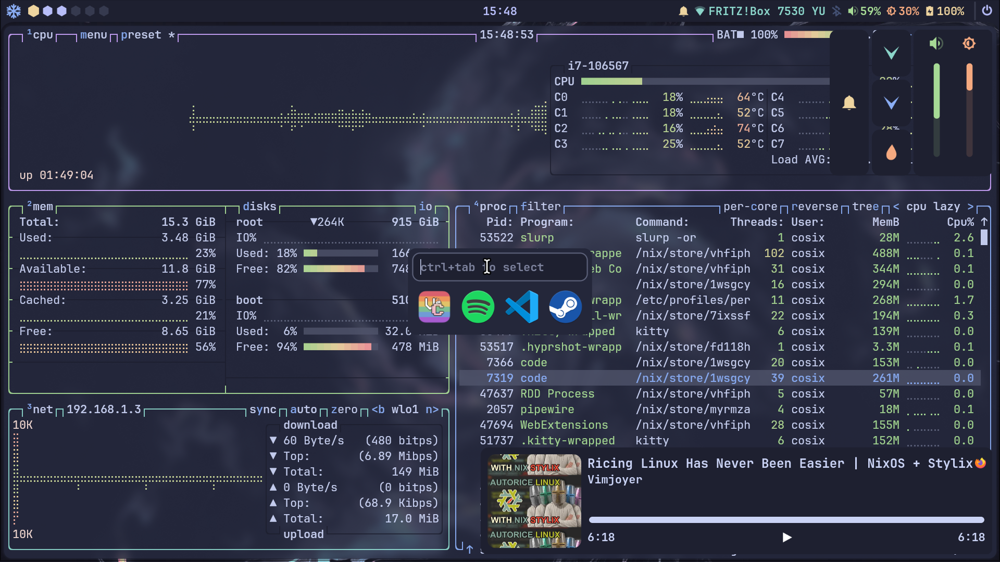

<div align="center"></div>


# nix-0
A simple ***❄ NixOs configuration ❄*** using [**Hyrpland**](https://github.com/hyprwm/Hyprland) and [**Ags**](https://github.com/Aylur/ags) themed using [**Stylix**](https://github.com/danth/stylix) and [**Catppuccin Macchiato**](https://catppuccin.com/palette) colors.

<div align="center"></div>

# Installation
1. **Clone the repository** in the home directory or where you want:
```bash
git clone https://github.com/Numb-0/nix-0.git ~/nix-0
```
2. **Navigate to directory**
```bash
cd ~/nix-0
```
3. **Apply flake configuration**
```bash
sudo nixos-rebuild switch --flake .#nixos
```
# Ags
The ags application is quite bounded with Hyprland so if you are using another WM most of the features won't work.\
For example i'm using the Hyprland keybinds to hide/show different windows of the ags application.

# Personalization
Some of the configuration values are in the [variables.nix](hosts/nixos/variables.nix) file.
The file contains variables that are used to set options in different part of the configuration like hyprland, git and others.

> [!WARNING] 
> Not all the settings are covered by variables, some options have been manually written in [config.nix](hosts/nixos/config.nix)!

# Docs
> [!NOTE]
>The docs folder contains information about commands and nix not the configuration. It's still a work in progress.
# Keybinds

| Keys | Action |
| :--- | :---  |
| <kbd>Super</kbd> + <kbd>Q</kbd> | Close focused window |
| <kbd>Super</kbd> + <kbd>T</kbd> | Launch terminal |
| <kbd>Shift</kbd> + <kbd>Enter</kbd> | Toggle window fullscreen|
| <kbd>Super</kbd> + <kbd>A</kbd> | Bring up Applauncher|
| <kbd>Super</kbd> + <kbd>D</kbd> | Bring up Dashboard |
| <kbd>Super</kbd> + <kbd>P</kbd> | Bring up AudioPlayer |
| <kbd>Super</kbd> + <kbd>C</kbd> | Remove Last Notification|
| More to add |

